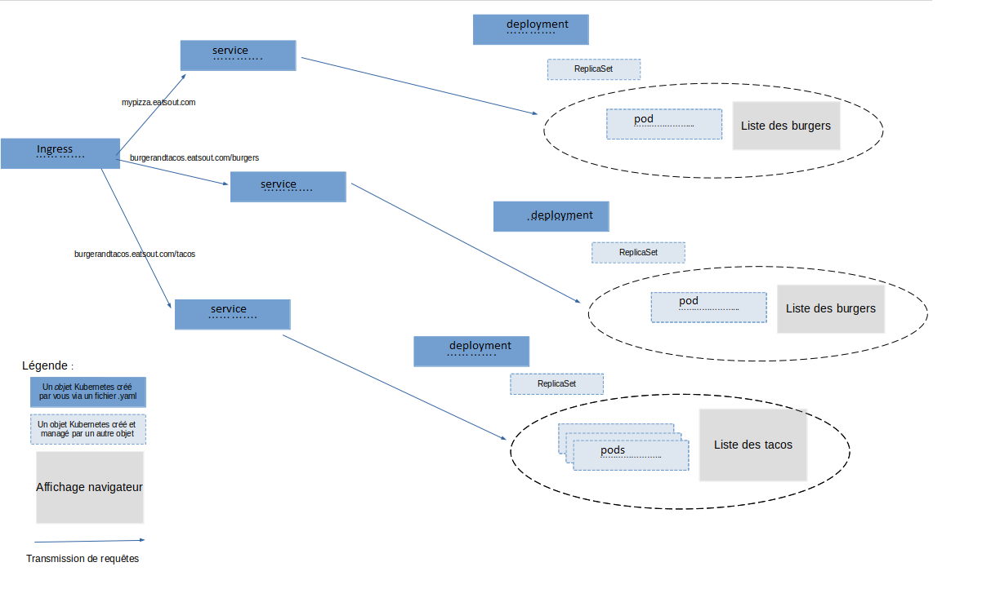

# Kubernetes-TP2

## 1 - Installation kind


```
curl -Lo ./kind https://kind.sigs.k8s.io/dl/v0.17.0/kind-linux-amd64
chmod +x ./kind
sudo mv ./kind /usr/local/bin/kind
```

On lance ensuite le cluster avec la commande :

```
cat <<EOF | kind create cluster --config=-
kind: Cluster
apiVersion: kind.x-k8s.io/v1alpha4
nodes:
- role: control-plane
  kubeadmConfigPatches:
  - |
    kind: InitConfiguration
    nodeRegistration:
      kubeletExtraArgs:
        node-labels: "ingress-ready=true"
  extraPortMappings:
  - containerPort: 80
    hostPort: 80
    protocol: TCP
  - containerPort: 443
    hostPort: 443
    protocol: TCP
EOF
```

## 2 - Installation d'ingress nginx

On déploit notre ingress directement depuis github grace à la commande :

```
kubectl apply -f https://raw.githubusercontent.com/kubernetes/ingress-nginx/main/deploy/static/provider/kind/deploy.yaml
```

ou

```
kubectl apply -f ingress-nginx.yml
```
On attends ensuite qu'il soit en ligne avec :

```
kubectl wait --namespace ingress-nginx \
  --for=condition=ready pod \
  --selector=app.kubernetes.io/component=controller \
  --timeout=90s
```
## 3 - Schéma

schema.png


## 4 - build et publication

### Création des images 

Pour créer les images, on utilise docker build à partir de Dockerfiles basiques

```
FROM nginx
COPY src/HTML/burger/index.html /usr/share/nginx/html
```
On construit ensuite les images en précisant notre nom d'utilisateur dockerhub. 
 

```
docker build -t pvigynov/nginx-burger:init ./burger
docker build -t pvigynov/nginx-pizza:init ./pizza
docker build -t pvigynov/nginx-tacos:init ./tacos
```

### Push vers dockerhub

Pour envoyer nos images vers dockerhub, on utilisera la commande `docker push`.

Il faut vérifier que nous sommes bien connecté avec la commande `docker login` sans quoi nous recontrons l'érreur `denied: requested access to the resource is denied`

```
docker push pvigynov/nginx-burger:init
docker push pvigynov/nginx-pizza:init
docker push pvigynov/nginx-tacos:init
```
## 5 - Reproduction de l'architecture 

### Déploiement des pods

On déploit ensuite les pods via nos fichiers yml grace aux commandes :

```
kubectl apply -f deployments.yml
```
Output `kubectl get pods`:

```
NAME           READY   STATUS    RESTARTS   AGE
nginx-burger   1/1     Running   0          7s
nginx-pizza    1/1     Running   0          7s
nginx-tacos    1/1     Running   0          7s
```

### Services

On ajoute ensuite nos services.

Output `kubectl get services`:
```
NAME             TYPE        CLUSTER-IP      EXTERNAL-IP   PORT(S)    AGE
burger-service   ClusterIP   10.96.169.221   <none>        8080/TCP   58s
kubernetes       ClusterIP   10.96.0.1       <none>        443/TCP    114m
pizza-service    ClusterIP   10.96.95.58     <none>        8082/TCP   58s
tacos-service    ClusterIP   10.96.93.75     <none>        8081/TCP   88s
```

### Ingress

En utilisant le fichier de configuration fourni par la documentation, le pod ingress reste en pending.
En utilisant la commande `kubectl describe pod  -n ingress-nginx <nom du pod>` on peut voir qu'aucun node n'est disponible :

```
Warning  FailedScheduling  25s   default-scheduler  0/1 nodes are available: 1 node(s) didn't match Pod's node affinity/selector. preemption: 0/1 nodes are available: 1 Preemption is not helpful for scheduling.
```

Pour pouvoir lancer le pod, il faut commenter les lignes suivantes dans le fichier yml :

```
nodeSelector:
    ingress-ready: "true"
    kubernetes.io/os: linux
```

Ou utiliser le la commande en point 1

Output de `kubectl get pods -n ingress-nginx` en utilisant le fichier custom :
```
NAME                                        READY   STATUS      RESTARTS   AGE
ingress-nginx-admission-create-tzn24        0/1     Completed   0          74s
ingress-nginx-admission-patch-c6sf4         0/1     Completed   1          74s
ingress-nginx-controller-5d7557f4cc-br5qq   1/1     Running     0          38s
```

## Réplication

Pour ajouter des réplicats, on va modifier notre fichier de déploiement en ajoutant la lignes suivante sous `spec` :

```
  replicas: 3
``` 

On vérifie que les pods sont créés avec `kubectl get pods` :

```
NAME                           READY   STATUS    RESTARTS   AGE
nginx-burger                   1/1     Running   0          55m
nginx-burger-5cf7b7666-wrw9d   1/1     Running   0          38m
nginx-pizza                    1/1     Running   0          55m
nginx-pizza-77dc9c6cb5-dhstb   1/1     Running   0          37m
nginx-tacos                    1/1     Running   0          55m
nginx-tacos-7d65d44f69-4nsmf   1/1     Running   0          30s
nginx-tacos-7d65d44f69-hndj6   1/1     Running   0          38m
nginx-tacos-7d65d44f69-lwpdh   1/1     Running   0          30s
```

### 7 - Màj des images 


Après avoir modifié le contenu de nos fichiers html, on re-build nos images grace aux commandes déjà utilisées en modifiant le tag:

```
docker build -t pvigynov/nginx-burger:newmenu ./burger
docker build -t pvigynov/nginx-pizza:newmenu ./pizza
docker build -t pvigynov/nginx-tacos:newmenu ./tacos
```

et on les pousses avec docker push.
On applique ensuite les modifications avec `kubectl apply -f deployment.yml`

On peut voir que les containers sont recréés en parallèle avant de remplacer les anciens, minimisant ainsi le downtime